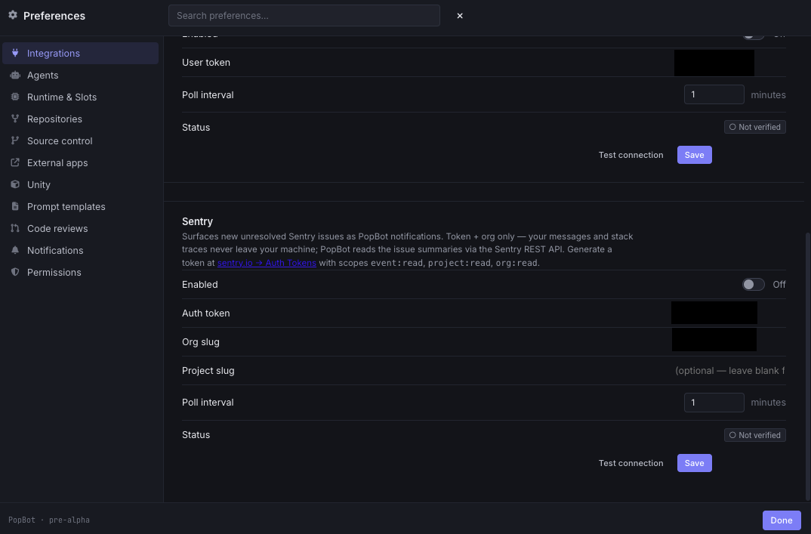
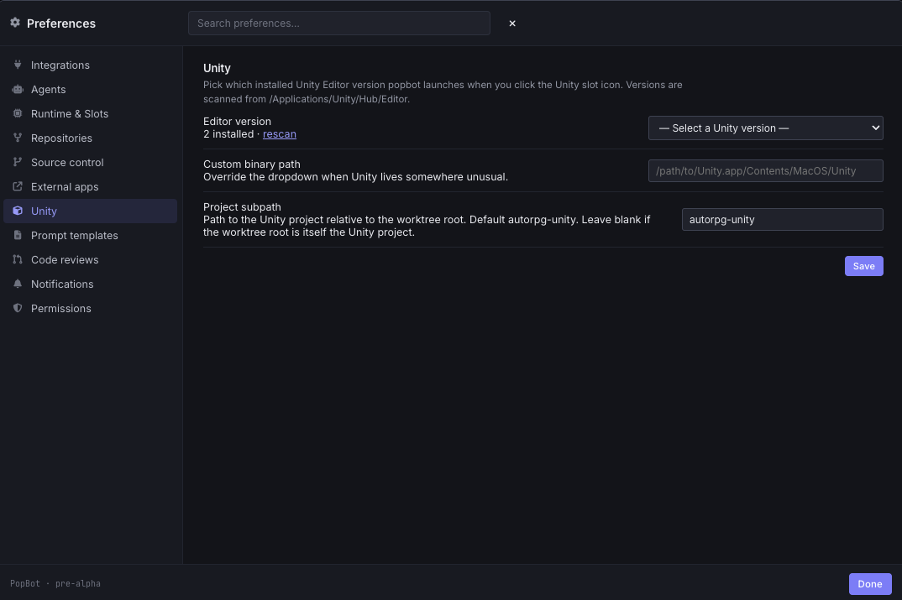

# Configuring PopBot

Everything in PopBot is configured in-app through **Preferences** (the gear in the title bar, or `⌘,`) — there are no config files to hand-edit. This guide walks through every panel in the order you'd set them up for the first time.

> Credentials you enter (Linear, GitHub, etc.) are stored **locally on your machine** in the app's own database — never in this repository.

- [Integrations](#integrations) · [Repositories](#repositories) · [Source control](#source-control) · [Runtime & slots](#runtime--slots) · [Agents](#agents) · [External apps](#external-apps) · [Unity](#unity) · [Prompt templates](#prompt-templates) · [Code reviews](#code-reviews) · [Notifications](#notifications) · [Permissions](#permissions)

---

## Integrations

Connect the services that feed your inbox. **Linear** and **GitHub** are the live sources; **Slack** and **Sentry** are present as connection stubs.

- **Linear** — paste an API key (from *linear.app → Settings → API*). Optionally set a **Team key** (e.g. `ENG`) to scope the ticket feed to one team, and a **Project** to narrow it further. Hit **Test connection**, then **Save**; the status pill turns *Connected*.
- **Slack** *(stub)* — a user OAuth token field for surfacing DMs and @-mentions as notifications. Read-only; PopBot never posts on your behalf.

- **Sentry** *(stub)* — an auth token + org slug, intended to surface unresolved issues as notifications. Token and org only; your data stays on your machine.

Each integration has its own **Test connection** button so you can verify credentials before saving.

## Repositories

Each chat lives in a **repository**. Add one row per repo PopBot should drive.

- **Add a repo** with the **New repository** button, then set its path, default base branch, color, and slot prefix.
- **Mode** is chosen at creation and is permanent: **slots** (a reused pool of worktrees — the default, shown as `slots × N`) or **ephemeral** (a fresh worktree per chat). Switching modes later would orphan in-flight worktrees, so it's locked.
- **Edit** or **Delete** any repo; deleting warns you if chats still reference it.

Multiple repos run side by side, each with its own slot pool and color (the color tints that repo's slot pills so you can tell chats apart at a glance).

## Source control

How branches and worktrees are named for a repo.

- **Branch username** — the prefix for new branches: `<username>/<ticket>-<slug>`.
- **Repo path** — absolute path to the source clone (with a **Browse…** button).
- **Repo short name** — the folder segment used in worktree paths and the parking-branch prefix.
- **Repo color** — any CSS color, used for this repo's slot pills.
- **Slot prefix** — folder + branch prefix per slot (worktrees become `<prefix>-N`).
- **Worktrees directory** — where slot worktrees live (defaults to `~/popbot/workspaces/<repoName>`).
- **Default base branch** — what new chat branches fork from (e.g. `develop`).
- **Action templates** — the prompts the git panel sends to the agent for **Commit**, **Push PR**, **Make ready**, **Address CR**, **Rebase onto base**, etc. Each supports `${name}` macros (`${branch}`, `${baseBranch}`, `${ticket}`, `${prnum}`, `${prurl}`…).

## Runtime & slots

The size and state of your worktree pool — your parallelism budget.

- **Maximum concurrent slots** — how many agents can hold a worktree at once (default 3). Changing it only resizes the pool; existing slot worktrees stay on disk.
- **Slot status** — a live grid of every slot: *Parked, ready* (free) or in use by a chat. **Initialize slots** pre-creates all N worktrees in parallel; **Delete all slots** tears them down (requires all chats closed).
- **Attachment retention** — how long files/images you paste into chats are kept in PopBot's own storage (default 60 days, range 1–365). A startup sweep deletes older copies.

## Agents

Default model **reasoning effort** for newly created chats (existing chats keep their own until you change them in the composer).

- Set effort independently for **Claude** and **Codex**, and separately for:
  - **New chats** — generic and ticket chats.
  - **Code reviews** — PR review chats and review notifications.

Higher effort means deeper reasoning and more thorough tool use, at higher cost and latency. Reviews often want a different depth than feature builds — hence the split.

## External apps

The desktop apps PopBot launches from a chat's icon row, all pointed at that chat's worktree.

- **Terminal** — which terminal the terminal-icon launcher opens (e.g. iTerm2).
- **Code editor** — VS Code or Cursor; also used for the clickable `file.ts:42` links in Edit tool rows.
- **Git client** — defaults to GitHub Desktop.
- **Unity Editor** — an absolute path to a Unity binary to launch slots directly (leave blank to route through Unity Hub).
- **Chrome profile for URLs** — pin link-opens to a specific Chrome profile (by its profile *directory* name) so they always land in your work account.

## Unity

For game projects, which Unity Editor a slot launches.

- **Editor version** — pick from installed Unity versions (scanned from `/Applications/Unity/Hub/Editor`), with a **rescan** link.
- **Custom binary path** — override the dropdown if Unity lives somewhere unusual.
- **Project subpath** — the Unity project's path relative to the worktree root. Leave blank if the worktree root *is* the Unity project.

## Prompt templates

The first message PopBot sends when a chat spawns. Every template is editable, with a reference card of the `${name}` macros available to it.

- **Start ticket** — fired when you spawn a chat from a Linear ticket (`${ticketid}`, `${tickettitle}`, `${markdown}`, `${branch}`, `${slot}`, …).
- **Start code review** — fired when you spawn a chat from a PR (`${prnum}`, `${prtitle}`, `${branch}`, `${slot}`). The default directs the agent to use the review skill and treat the chat as read-only.
- **Re-review** — fired when you click re-review on an existing review chat; scopes the agent to new commits.

Tune these to encode your team's conventions, checklists, and tone. (Git-panel action templates live under [Source control](#source-control).)

## Code reviews

Controls for the **Reviews** inbox.

- **Search cache window** — how many days back the **+ Add** picker fuzzy-matches Linear issues + GitHub PRs (bigger = more searchable, slightly slower refresh). Tickets assigned to you are always included.
- **Ignore by title** — substrings (one per line) that drop a PR from the queue.
- **Ignore by GitHub author** — bot/author logins (one per line, e.g. `renovate[bot]`) to mute.

## Notifications

How alerts surface.

- **VIP names** — people whose Slack DMs/mentions always get bumped to urgent priority. Matched as case-insensitive substrings of the Slack display name, so keep names specific.
- **Toast placement** — *Top-center, fly to bell on dismiss* (default), or classic top-right corner toasts.
- **Test new-item flow** — temporarily flag a few real queue items as NEW to preview the chip/pip behavior (nothing is persisted).

## Permissions

The global default for each agent tool, and the floor under autonomous mode.

- For each tool (**Bash**, **Read**, **Write**, **Edit**, **Grep**, **Glob**, **WebFetch**, …): **Ask** (prompt each time — the default), **Allow** (auto-approve), or **Deny** (auto-reject).
- Per-chat rules (set from the permission card via *Allow this chat* / *Deny this chat*) override these globals, so a single chat can lock down a tool you've otherwise allowed everywhere.

> A hard-deny floor — `git push`, network to non-allowlisted hosts, anything outside the worktree — lives in code and is **not** overridable here, so a misconfigured rule can't let an agent push to `main` on its own.

---

See the **[Feature & Workflow Guide](GUIDE.md)** for how these settings play out in real workflows.
