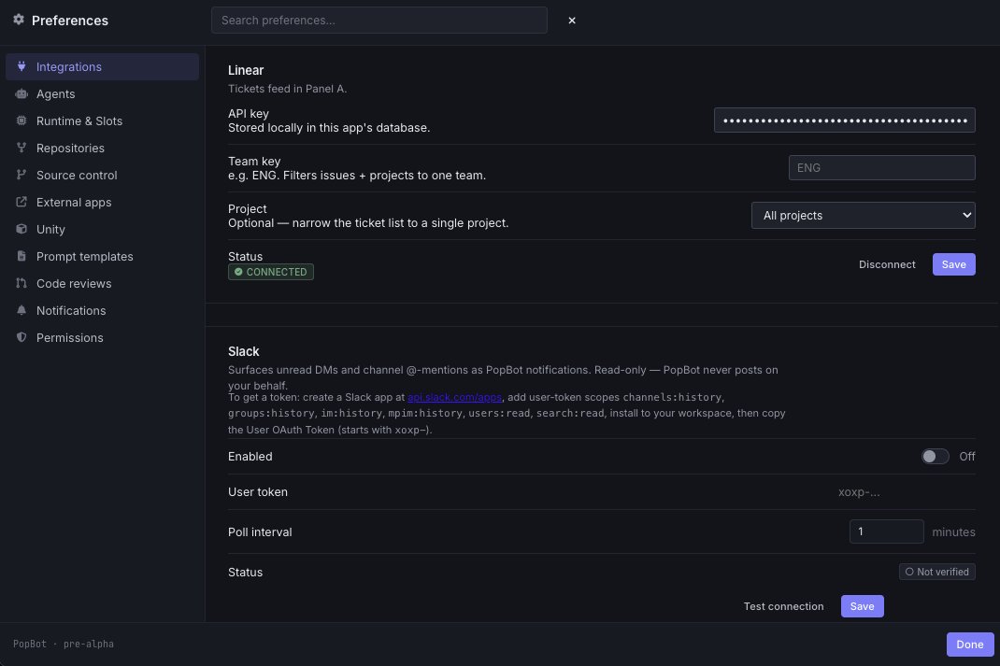
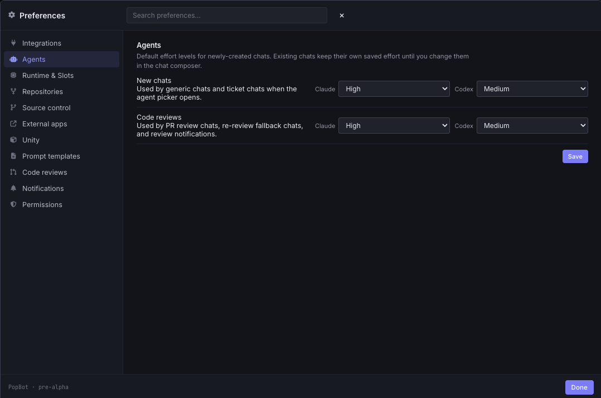
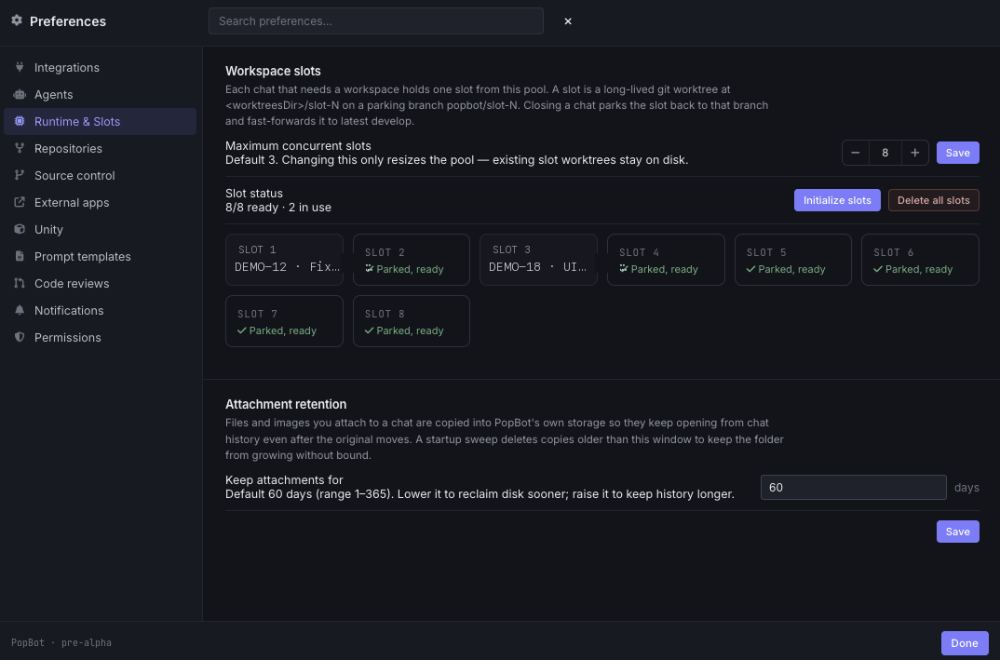
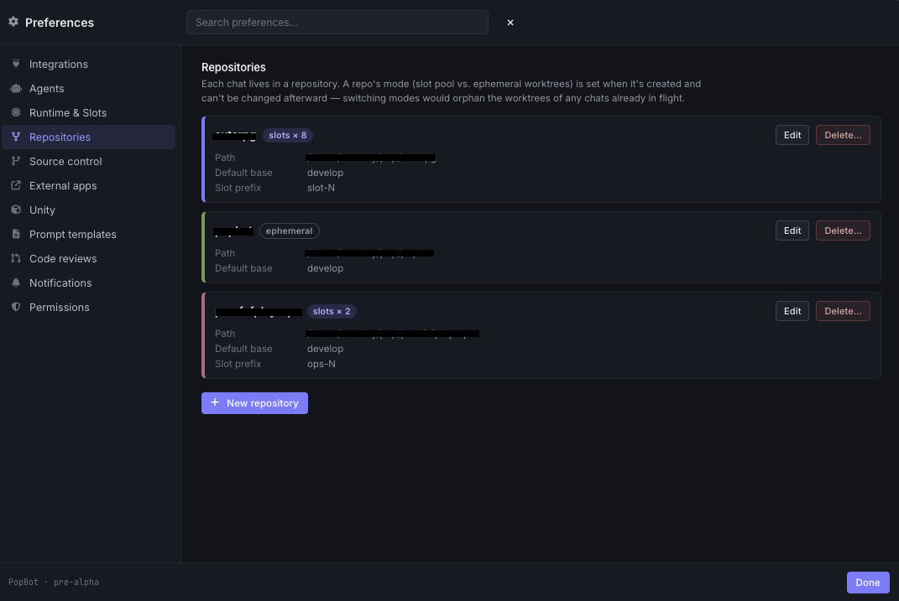
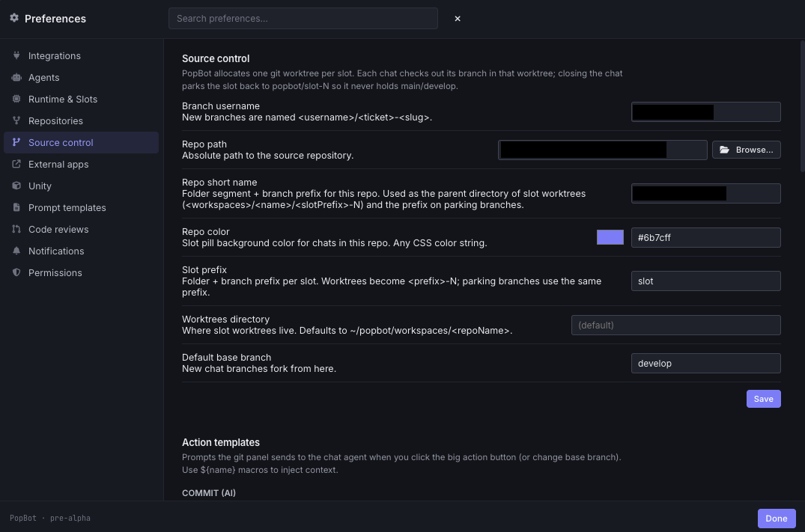
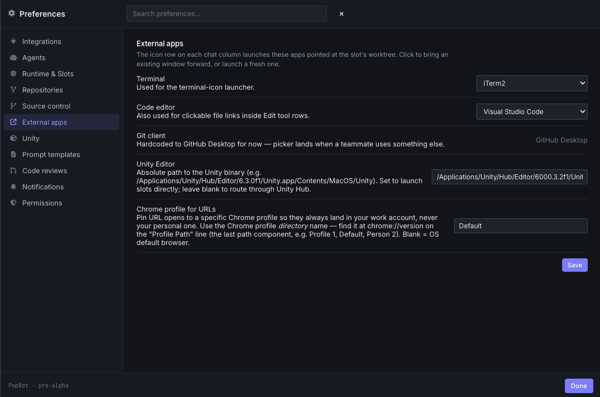
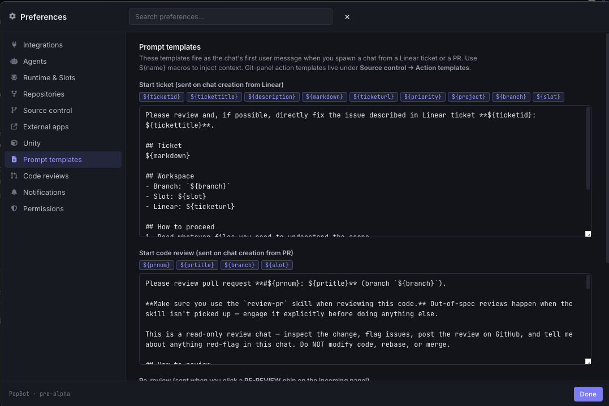
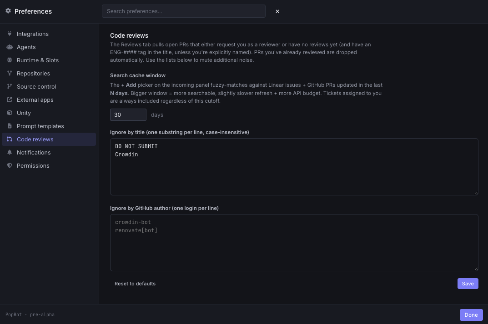
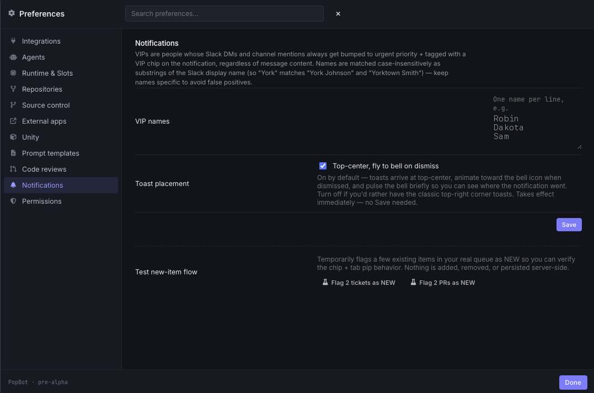
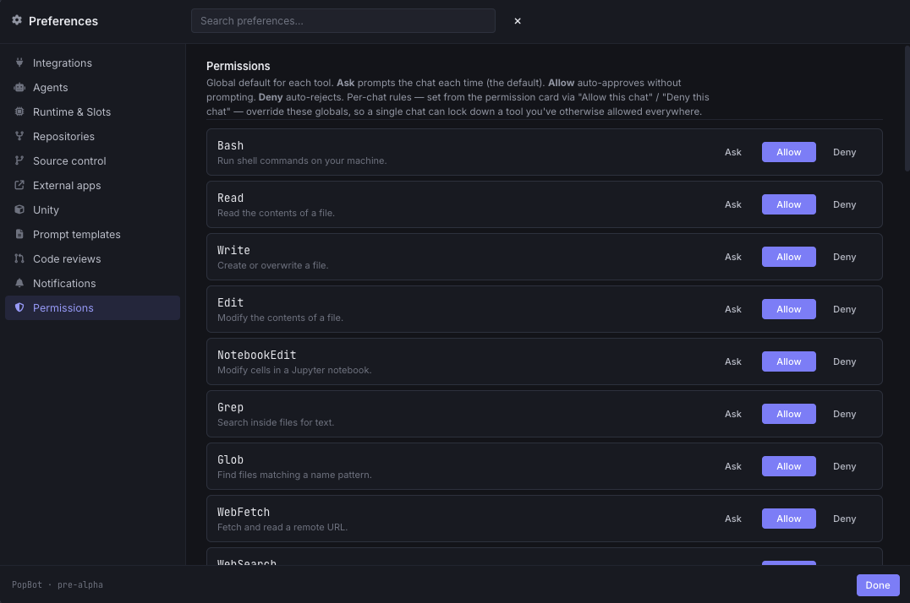

# Configuring PopBot

Everything in PopBot is configured in-app through **Preferences** (the gear in the title bar, or `⌘,`) — there are no config files to hand-edit. This guide walks through every panel in the order the nav lists them, which is roughly the order you'd set them up for the first time. There is no Save button anywhere: a field is saved the moment you leave it (or press Enter), a switch the moment you flip it, and closing Preferences saves whatever is still pending.

> Credentials you enter (Linear, Jira, GitHub, Perforce, etc.) are stored **locally on your machine** in the app's own database — never in this repository.

- [Integrations](#integrations) · [Agents](#agents) · [Runtime & slots](#runtime--slots) · [Repositories](#repositories) · [Source control](#source-control) · [External apps](#external-apps) · [Prompt templates](#prompt-templates) · [Code reviews](#code-reviews) · [Notifications](#notifications) · [Permissions](#permissions) · [Language](#language)

---

## Integrations

Two independent groups live here: the **ticket source** that feeds the Tickets queue, and the **game engines** a slot can launch.



### Ticket source

A single active issue tracker feeds the Tickets queue. Pick it from the selector at the top of the panel; the config form below swaps to match. Only one tracker is active at a time.

- **Linear** — paste an API key (from *linear.app → Settings → API*). Optionally set a **Team key** (e.g. `ENG`) to scope the ticket feed to one team, and pick a **Project** to narrow it further. Saving verifies the key and shows who it connected as.
- **Jira** — enter your site URL (`https://your-domain.atlassian.net`), the account email, and an API token (from *id.atlassian.com → Security → API tokens*). Optionally scope to a **Project** and add a **JQL** filter (e.g. `labels = backend`). Saving verifies the credentials before persisting them.
- **GitHub** — GitHub Issues need no credentials here: the provider shells out to the `gh` CLI you've already authenticated for reviews and git actions, and the queue spans the same repositories configured under [Repositories](#repositories). The form is a status check that confirms `gh` is installed and authenticated and reports how many repos it covers.

Each tracker with credentials verifies them as soon as you leave a credential field, saves them either way, and shows a *Connected / Not connected* status pill with the verdict.

### Game engines

Unlike the single-select ticket source, engines are **independent** — you can enable Unity, Unreal, and a Custom engine at once. Each enabled engine adds a **Run** button to the chat bar that launches its editor from the chat's slot workspace.

- **Enabled** — a per-engine checkbox that surfaces (or hides) that engine's Run button on the chat bar.
- **Detected installs / Editor binary** *(Unity, Unreal)* — PopBot scans for installed editors (Unity Hub / Epic installs), with a **rescan** link; pick a detected version, or enter an absolute **Editor binary** path to override the dropdown.
- **Run command** *(Custom)* — a freeform shell command run in the project directory, with separate **macOS / Linux** and **Windows** variants so one config works cross-platform. A custom engine has no auto-detection; PopBot passes the slot identity through to your command via a `POPBOT_SLOT` environment variable so you can wire up your own "run and verify" flow.
- **Project subpath** — the engine project's path relative to the workspace root (the Unity project folder; the folder holding the `.uproject`; or the cwd a custom command runs in). Leave blank if the workspace root *is* the project.
- **Use MCP + Base MCP port** *(Unity, Unreal)* — when the **Use MCP** checkbox is on, the editor is launched pointed at an in-editor MCP server so an agent can drive it. Each slot gets its **own port** so parallel slots never collide: the port is `basePort + (slotId − 1)` (slot 1 → base, slot 2 → base + 1, …). The **Base MCP port** field sets slot 1's port; it defaults to **8000 for Unreal** and **8080 for Unity** (matching each engine's MCP plugin default) and is restored to that default when cleared.
- **Show project path in title bar** *(Unity)* — an **Install title-bar script** button that drops a small editor script into your Unity project so each open Editor shows its full project path in its title bar, making slot windows easy to tell apart. The script is safe to commit.

> **Slack** and **Sentry** remain connection stubs rather than wired inbox sources, so they are not shown as panels here today. They can be re-enabled without structural changes; see the note at the end of the [Feature & Workflow Guide](GUIDE.md).

## Agents

Default model **reasoning effort** for newly created chats (existing chats keep their own until you change them in the chat composer).



- Set effort independently for **Claude** and **Codex**, and separately for:
  - **New chats** — generic and ticket chats.
  - **Code reviews** — PR review chats, re-review fallback chats, and review notifications.

Higher effort means deeper reasoning and more thorough tool use, at higher cost and latency. Reviews often want a different depth than feature builds — hence the split.

**Steer Codex while it works** *(off by default)* — connects to Codex through its `app-server` instead of the exec SDK. With it on, a message you send while Codex is busy is folded into the running turn and reaches the model at its next step — usually the moment the command in flight returns — instead of waiting for the turn to end. It also fills the context gauge for Codex chats, enables **Compact context** for them, and makes **Stop** interrupt the turn cleanly. Codex labels `app-server` experimental and it needs `codex` 0.153 or newer, which is why it is opt-in; an older CLI simply falls back to queueing. The switch applies from each chat's next message, and a chat moves between the two connections without losing its thread.

**PopBot tools for agents** *(on by default)* — hands every chat's agent a `popbot` MCP server with tools to list, create, close and reopen chats, message another chat and wait for its answer, start code reviews and ticket chats, and read and search transcripts (see [PopBot tools for agents](GUIDE.md#popbot-tools-for-agents)). The server listens on localhost only, on a random port with a per-launch secret in its URL. Switching it off applies from each chat's next agent session.

**Cloud chats** — the *Anthropic API key* cloud chats run on (stored locally; falls back to the `ANTHROPIC_API_KEY` environment variable) and the *GitHub token* the sandbox clones repositories with (`repo` scope; falls back to `gh auth token`). A cloud chat with a repository needs both; one without needs only the key. Saving with a key checks it against the API first. Cloud sessions are billed by the token to the key's Console account, not to a Claude subscription. On first use PopBot creates one environment and one agent per model and effort in that account and reuses them afterwards (see [Run in the cloud](GUIDE.md#chats)). An organization-level key (one not created inside a workspace) also needs the *Workspace ID* (`wrkspc_…`, from the Console's Workspaces page); the key check says so when it is missing.

## Hosts

Other machines that run chats for this PopBot. Each runs `popbot-host`, a single-file Node daemon built from this repository:

```sh
npm run build:host                       # writes dist-host/popbot-host.cjs
node dist-host/popbot-host.cjs --init --repo popbot=/path/to/checkout
node dist-host/popbot-host.cjs           # listens on 127.0.0.1:7677
```

`--init` writes `~/.popbot-host/config.json` (bind address, port, a random bearer token, a workspaces folder, the repositories by id and path) and prints the token; edit the file, or pass `--port`, `--bind`, `--token`, `--name`, `--workspaces` and more `--repo id=/path` flags. The host needs Node 20 or newer and the `claude` and/or `codex` CLI on its PATH. It copies nothing from this machine and keeps no transcript — only the live sessions and their event log, which a reconnecting PopBot replays from where it left off. It binds to localhost; reach a remote box over an SSH tunnel (`ssh -L 7677:127.0.0.1:7677 box`) rather than exposing the port.

In PopBot, *Add host* creates a record with the local address filled in; set the name, URL and token (the fields save when you leave them), and the panel asks the host what it is: its version, whether it found Claude and Codex, and its repositories. A host's worktrees live under its workspaces folder (`~/.popbot-host/workspaces/<repo>/<branch>`); attachments you send land under `attachments/<chat id>` there. Permission rules travel with each request, so *Always allow* decisions apply on the host the same way. Remove a host and chats already on it stay in the list but can no longer reach it. See [Run on another box](GUIDE.md#chats).

## Runtime & slots

This panel controls **attachment retention**. (Slot-pool sizing is now per-repository and lives under [Repositories](#repositories) — see the note there.)



- **Keep attachments for** — how long files and images you attach to a chat are kept in PopBot's own storage (default 60 days, range 1–365). Attachments are copied into PopBot's storage so they keep opening from chat history even after the original moves; a startup sweep deletes copies older than this window so the folder can't grow without bound.

> The screenshot above may predate the split of slot-pool sizing into the per-repo flow.

## Repositories

Each chat lives in a **repository**. This panel lists your repos and is where per-repo source control, slots, and copy-on-write workspaces are configured.



- **Add Repository** opens a folder-first wizard: pick a folder, and PopBot **detects its source control** (Git or Perforce) and branches accordingly. You then set an id, accent color, slot prefix, and slot count.
  - **Git** repos choose **slots** mode (a reused pool of workspaces — the default, shown as `slots × N`) or **ephemeral** (a fresh workspace per chat). Slots mode keeps build caches warm across chats.
  - **Perforce** repos are always slot mode. The wizard captures the P4 connection, runs a **disk pre-flight**, and builds a frozen **base image** of the synced tree; slots are then created as copy-on-write children of that base (see below).
- **Copy-on-write workspaces.** A slot's workspace is a copy-on-write folder that shares one **base image** of the repo and stores only the blocks it changes, via `shado` (PopBot's shadow-workspace layer): **differencing VHDX** on Windows, native copy-on-write (APFS / reflink) on macOS and Linux. Ten slots on a terabyte-scale tree cost roughly the disk of one repo plus each slot's small delta — which is what lets large Perforce trees participate at all. The base image is built once, as a step of the Add-Repository wizard.
- **Mode is permanent.** A repo's slots-vs-ephemeral mode is fixed at creation; switching would orphan the workspaces of in-flight chats.
- **Edit** a repo to change its accent color, default base branch (Git), or Perforce agent working directory, and to **Resize slots** (grow or shrink the pool one workspace at a time, gated on all chats in that repo being closed).
- **Delete** a repo; the confirmation warns you if chats still reference it.

Multiple repos run side by side, each with its own slot pool and accent color (the color tints that repo's slot pills so you can tell chats apart at a glance). Each repo card shows its source-control provider and mode.

## Source control

Global source-control settings and the editable action templates. Git and Perforce panels are shown side by side, because a repo's provider is detected per folder and both may be in use at once.



- **Change-view file limit** *(shared)* — the most files shown in the change view before the list is capped. Applies to both Git and Perforce.

**Git**

- **Branch username** — the prefix for new branches: `<username>/<ticket>-<slug>`.
- **Action templates** — the prompts the SCM panel sends to the agent for **Commit**, **Push PR**, **Push draft PR**, **Make ready**, **Address CR**, and **Rebase onto base**. Each supports `${name}` macros (`${branch}`, `${baseBranch}`, `${ticket}`, `${prnum}`, `${prurl}`…).

**Perforce**

- **Connection defaults** — the `p4` binary path, default server port, and default user, which pre-fill the Add-Repository → Perforce connect step.
- **Transfer / submit options** — number of parallel sync threads, and whether to revert unchanged files on submit.
- **Swarm review poll interval** — how often the Reviews panel polls Helix Swarm for changelists awaiting your review. This is **independent of GitHub's polling** and has a **30-second floor**; raise it to lighten the load on a shared Perforce/Swarm server at scale.
- **Perforce action templates** — the prompts the Perforce panel sends the agent for **CR** (open/update a Helix Swarm review), **Run tests**, and **Review & commit**, each with `${name}` macros.

## External apps

The desktop apps PopBot launches from a chat's icon row, all pointed at that chat's slot workspace.



- **Terminal** — which terminal the terminal-icon launcher opens (e.g. iTerm2).
- **Terminal shell (Windows)** — the shell used by the in-app terminal panel: PowerShell, Command Prompt, or PowerShell 7. Applies to terminals opened after the change.
- **Code editor** — VS Code or Cursor; also used for the clickable `file.ts:42` links in Edit tool rows.
- **Git client** — defaults to GitHub Desktop.
- **Chrome profile for URLs** — pin link-opens to a specific Chrome profile (by its profile *directory* name) so they always land in your work account.

> Engine binaries and their MCP options are configured under [Integrations → Game engines](#integrations), not here.

## Prompt templates

The first message PopBot sends when a chat spawns. Every template is editable, with a reference card of the `${name}` macros available to it. (SCM-panel action templates live under [Source control](#source-control).)



- **Start ticket** — fired when you spawn a chat from a ticket, regardless of source (Linear, Jira, or GitHub Issues). Macros include `${ticketid}`, `${tickettitle}`, `${markdown}`, `${branch}`, and `${slot}`.
- **Start code review** — fired when you spawn a chat from a review — a GitHub PR or a Helix Swarm changelist. The default directs the agent to use the review skill, read the surrounding code (not just the diff), and treat the chat as read-only.
- **Re-review** — fired when you re-review an existing review chat; it scopes the agent to the new commits only.

Tune these to encode your team's conventions, checklists, and tone.

## Code reviews

Controls for the **Reviews** inbox. The queue surfaces GitHub PRs and Helix Swarm changelists awaiting your review; PRs you've already reviewed are dropped automatically.



- **Search cache window** — how many days back the **+ Add** picker fuzzy-matches recent tickets and PRs (bigger = more searchable, slightly slower refresh and more API budget). Tickets assigned to you are always included regardless of this cutoff.
- **Ignore by title** — substrings (one per line, case-insensitive) that drop a PR from the queue.
- **Ignore by GitHub author** — bot/author logins (one per line, e.g. `renovate[bot]`) to mute.

> Review **poll rates** are configured per provider, not here: the Helix Swarm poll interval lives under [Source control → Perforce](#source-control), independent of GitHub's polling, so a shared Perforce/Swarm server can be protected without slowing GitHub.

## Notifications

How alerts surface.



- **VIP names** — people whose messages always get bumped to urgent priority. Matched as case-insensitive substrings of the display name, so keep names specific.
- **Toast placement** — *Top-center, fly to bell on dismiss* (default), or classic top-right corner toasts. The toggle applies immediately.
- **Test new-item flow** — temporarily flags a few real queue items as NEW to preview the chip/pip behavior (nothing is persisted). This is a temporary development aid.

## Permissions

The global default for each agent tool, and the floor under autonomous mode.



- For each tool (**Bash**, **Read**, **Write**, **Edit**, **Grep**, **Glob**, **WebFetch**, **WebSearch**, …): **Ask** (prompt each time — the default), **Allow** (auto-approve), or **Deny** (auto-reject).
- **Per-MCP-server allowances.** A slot's editor MCP server (Unity, Unreal, or any MCP server an agent loads) can be permitted the same three ways. Granting a slot's editor MCP once is remembered, and the grant is visible and revocable here — shown as `unityEditor → all tools` / `unrealEditor → all tools` rather than the raw namespace. PopBot enables the Unity and Unreal editor MCPs this way automatically; a per-tool rule that differs from a wildcard is kept as an override.
- Per-chat rules (set from the permission card via *Allow this chat* / *Deny this chat*) override these globals, so a single chat can lock down a tool you've otherwise allowed everywhere.

> A hard-deny floor — `git push` / `p4 submit`, network to non-allowlisted hosts, anything outside the workspace — lives in code and is **not** overridable here, so a misconfigured rule can't let an agent land to mainline on its own.

## Language

PopBot's interface is fully localized.

- **Display language** — switch the interface locale from the language menu, which lists each language in its own name. The shipped locales are English, Spanish, French, German, Chinese (Simplified), Japanese, Korean, and Portuguese (Brazilian). Most text and the menus update right away; a few system strings finish updating after a restart. New windows and the app menu use this language too.

---

See the **[Feature & Workflow Guide](GUIDE.md)** for how these settings play out in real workflows.
