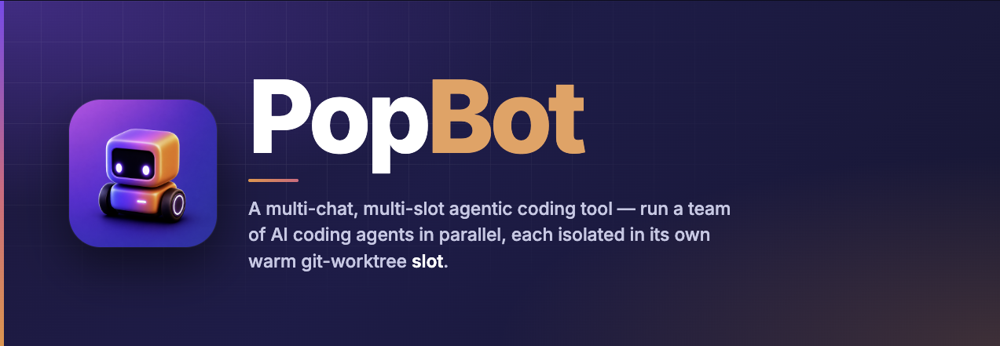
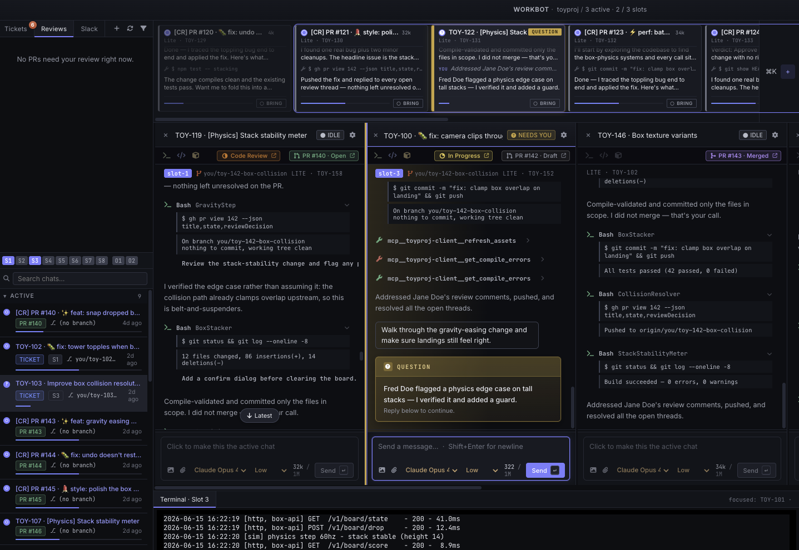
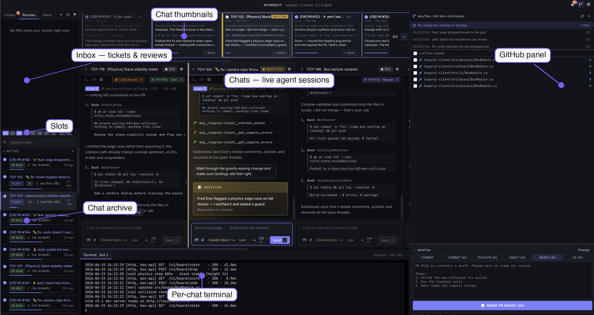

<div align="center">



Una herramienta de escritorio probada en batalla para ejecutar un equipo de agentes de codificación con IA en paralelo — uno por ticket, bug o revisión, cada uno aislado en su propio "slot" en caliente, cada uno capaz de compilar, ejecutar y probar tu aplicación de principio a fin.

[Por qué PopBot](#por-qué-popbot) · [Funcionalidades](#funcionalidades-definitorias) · [Cómo funciona](#anatomía-del-espacio-de-trabajo) · [Un día con PopBot](#un-día-con-popbot) · [Instalación](#instalación) · [Hazlo tuyo](#hazlo-tuyo)

</div>

---

## Por qué PopBot

Ejecutar un único agente de codificación con IA es sencillo. Ejecutar varios a la vez introduce problemas que un solo agente no tiene: mantener su trabajo aislado para que no se sobrescriban entre sí, probar de verdad lo que construyen, revisarlo, y bloquear las acciones irreversibles para que ningún agente tome una sin supervisión.

PopBot es una capa de orquestación para eso. Convierte tickets y solicitudes de revisión en sesiones de agente de un solo clic, le da a cada agente un espacio de trabajo aislado (su propia copia de trabajo — y, para proyectos de videojuegos, su propia copia en ejecución de la aplicación bajo prueba), los ejecuta de forma autónoma por defecto con una barrera humana en las acciones arriesgadas, y recopila cada transcripción, diff, terminal y log en una sola ventana. El operador recorre las columnas, aprueba las acciones bloqueadas, y publica.

Fue construido por un equipo pequeño en **Proof of Play** y se usó a diario en un proyecto de producción real, cargado de assets, que se lanzó al mercado. Ese es el entorno en el que se puso a prueba: muchos gigabytes de assets, control de código fuente real, plazos reales. El modelo de slots — espacios de trabajo en caliente, aislados, de copia en escritura (copy-on-write) — es lo que hizo práctico ejecutar agentes en paralelo allí, y aumentó cuánto podía lograr el equipo a la vez. Publicamos y damos soporte a PopBot como una implementación de referencia: no un producto terminado para consumir tal cual, sino una forma para tomar y remodelar según tu propia infraestructura y flujo de trabajo. Esto refleja una visión sobre cómo se construye mejor el software en la era de la IA: que a los equipos que ejecutan flotas de agentes les conviene más ser dueños de la herramienta y modificarla que adoptar una fija. Tiene licencia MIT y está organizado para poder bifurcarse (fork); consulta [Hazlo tuyo](#hazlo-tuyo).



<div align="center"><em>Una sesión real de PopBot — varios agentes trabajando en paralelo, cada uno en su propio slot. Miniaturas en vivo arriba, chats enfocados en columnas, una terminal por chat debajo, y el panel de control de código fuente a la derecha.</em></div>

## Funcionalidades definitorias

### Vista multi-chat con miniaturas en vivo

Cada chat abierto permanece en pantalla — una franja de **miniaturas en vivo** sobre **columnas** en paralelo. Cada miniatura es una vista real y actualizada de ese chat (no solo un punto de estado), codificada por color según su estado: en ejecución, terminado, esperándote, error. De un vistazo ves *qué está haciendo cada agente* y quién te necesita — y puedes **detectar un camino equivocado a tiempo**, redirigiendo antes de que consuma tiempo y tokens. Una persona supervisa toda una flota desde una sola ventana.

### Slots en caliente — agentes en paralelo sin el impuesto de la reimportación

Cada chat de trabajo arrienda un **slot** — una copia de trabajo persistente más su propio estado de compilación en caliente, creado una vez y reutilizado. Para un motor de videojuegos, eso significa que el slot mantiene su propia caché de assets en caliente (el `Library` de Unity, el DDC de Unreal) y puede mantener el editor en ejecución, de modo que volver a cambiar un agente a su slot toma **segundos, no una reimportación de varios minutos**. Diez agentes se ejecutan en verdadero aislamiento de ramas sin saturar una sola caché de importación. [Cómo funcionan los slots →](GUIDE.md#slots-espacios-de-trabajo-en-caliente-aislados-y-desechables)

### Copias ilimitadas en el disco de un solo repositorio

El espacio de trabajo de un slot es una **carpeta de copia en escritura (copy-on-write)**: cada slot comparte una única imagen base y almacena solo lo que cambia. Así, una copia completa, en vivo y actualizada de un árbol de videojuego **a escala de terabytes** está lista en **segundos** — archivos editables reales, no una vista superficial — y copias ilimitadas cuestan el disco de un solo repositorio. Esto funciona gracias a **[shado](https://github.com/popbot-ai/shado)**, nuestro motor de espacios de trabajo sombra de código abierto — funciona en **Windows, macOS y Linux** (VHDX diferencial en Windows; copia en escritura de APFS/XFS/btrfs en el resto), y es lo que permite que árboles de Perforce enormes se unan a la flota. [Por qué esto importa →](GUIDE.md#copia-en-escritura-copias-ilimitadas-en-el-disco-de-un-solo-repositorio)

### Git y Perforce, con revisión integrada

El control de código fuente es un **proveedor** detrás de una sola interfaz: **Git** (worktrees, ramas, PRs vía `gh`) y **Perforce** (streams sobre espacios de trabajo sombra, changelists, revisiones de **Helix Swarm**) son ambos de primera clase. Un panel de control de código fuente delimitado al *espacio de trabajo propio de cada chat* muestra el estado, los commits y los diffs por archivo de exactamente esa rama. Acciones plantilla de un solo clic (**Commit**, **Push PR**, **Make ready**, **Address CR**, **Rebase onto base**) envían una instrucción prellenada al agente de ese chat, con `${branch}` / `${ticket}` / `${prnum}` completados.

### Una bandeja de entrada, muchas fuentes

Todo el ciclo en un solo lugar: tu **bandeja de entrada** — tickets asignados de **Linear**, **Jira** y **GitHub Issues**, más revisiones que te esperan como **PRs de GitHub** y **changelists de Swarm** → trabajo de agente **en progreso** en slots aislados → **push** y abrir el PR / la revisión → **archivar** un chat terminado → **reabrirlo y reiniciarlo** más tarde con el historial completo. Haz clic en un ticket y PopBot nombra la rama, arrienda un slot, mueve el ticket a *En progreso*, y prepara al agente — luego lo lleva hasta un cambio fusionado y de vuelta. [Recorridos de flujo de trabajo →](GUIDE.md#flujos-de-trabajo-de-extremo-a-extremo)

## Funcionalidades adicionales

- **El verdadero Claude Code y Codex — no una reimplementación.** Cada chat impulsa el agente *real* a través de su SDK oficial — los mismos CLIs `claude` y `codex` que ejecutarías en una terminal, con todas sus herramientas, skills y servidores MCP intactos. Elige el modelo (Opus / Fable / GPT) y el esfuerzo de razonamiento por chat, cambia a mitad de sesión, o reinicia una sesión nueva preparada con el historial del chat.
- **Agentes que prueban su propio trabajo.** Un slot puede lanzar la aplicación real — para Unity y Unreal, un editor en vivo + un servidor sidecar en una segunda pantalla, impulsado por el agente a través de un servidor MCP dentro del editor en un **puerto por slot** — de modo que el agente navega por la interfaz, lee logs, y verifica sus cambios en lugar de adivinar. Los motores personalizados también son compatibles.
- **Chats persistentes y archivables.** Cada chat es una transcripción duradera; ciérralo para liberar su slot, y reábrelo más tarde con el historial completo intacto.
- **Terminal por chat y código clicable.** Una terminal integrada anclada al espacio de trabajo del chat, y enlaces `file.ts:42` que se abren en VS Code o Cursor.
- **Autónomo, pero nunca imprudente.** Los agentes ejecutan automáticamente el trabajo seguro dentro de su slot y se pausan para ti en cualquier cosa arriesgada — `git push` / `p4 submit`, abrir PRs, cualquier cosa fuera del espacio de trabajo, llamadas de red. Los permisos son por chat, duraderos y revocables — servidores MCP incluidos.
- **Totalmente localizado.** Toda la interfaz se distribuye en doce idiomas (inglés, español, francés, alemán, japonés, coreano, chino simplificado, portugués brasileño, ruso, italiano, polaco, ucraniano), intercambiables en cualquier momento desde el menú de idioma.
- **Multi-repositorio.** Maneja varios repositorios en paralelo, cada uno con su propio pool de slots, color, proveedor y convenciones de ramas.

## En qué se diferencia PopBot

Las herramientas de codificación agéntica tienden a agruparse en unas pocas categorías. PopBot ocupa un lugar distinto: una **cabina de control local para ejecutar muchos agentes *reales* en paralelo, con estado de compilación en caliente y supervisión humana en vivo.**

| En lugar de… | …PopBot |
|---|---|
| **Un agente en una terminal o IDE** — una sola tarea en un solo árbol de trabajo a la vez | **Muchos agentes a la vez**, cada uno aislado en su propio slot en caliente, todos visibles como una flota en vivo que diriges desde una sola ventana |
| **Agentes en la nube asíncronos** — opacos y remotos; envías una tarea, esperas un PR | **Local y en vivo** — observa a cada agente trabajar y detecta un camino equivocado a tiempo, y maneja *tu aplicación real* (un editor de motor en una segunda pantalla) para pruebas genuinas de extremo a extremo |
| **Malabares manuales con `tmux` + worktrees** — paralelo pero manual, y cada checkout nuevo paga el impuesto de reimportación de varios minutos del motor | **Slots en caliente gestionados** — espacios de trabajo reutilizados y de copia en escritura que mantienen la caché de assets caliente, con el ciclo de vida de rama/workspace, el panel SCM y la revisión de código gestionados por ti |
| **Frameworks de orquestación de agentes** — kits de herramientas para *construir* sistemas de agentes | **Una aplicación terminada y con criterio propio** conectada a tu bandeja de entrada y ciclo de revisión — con el humano en el ciclo por diseño, no una biblioteca para ensamblar |

Y, de manera crucial: PopBot no reemplaza a Claude Code ni a Codex — los **ejecuta**. Obtienes exactamente los agentes (y tus versiones exactas de CLI) en los que ya confías, solo que muchos a la vez, con la orquestación, el aislamiento y la supervisión envueltos alrededor de ellos.

## Anatomía del espacio de trabajo



| Región | Qué es |
|---|---|
| **Bandeja de entrada — tickets y revisiones** | Tickets asignados (Linear / Jira / GitHub Issues) y revisiones que te esperan (PRs de GitHub / changelists de Swarm), clasificados. Un clic genera un chat. |
| **Slots** | El pool de espacios de trabajo en caliente y aislados — una copia de trabajo de copia en escritura *más* estado de compilación persistente (para un motor de videojuegos, su propia caché de assets en caliente). Un chat arrienda uno mientras trabaja y lo devuelve al cerrarse. |
| **Archivo de chats** | Cada chat pasado, con búsqueda y reapertura con historial completo. |
| **Miniaturas de chat** | Una franja en vivo de todos los chats abiertos — codificada por color según el estado (en ejecución / terminado / te necesita / error). |
| **Chats** | Las sesiones de agente enfocadas: prosa, llamadas a herramientas, y diffs de código en línea, transmitidos en vivo. |
| **Terminal por chat** | Una terminal integrada apuntando al espacio de trabajo de ese chat. |
| **Panel SCM** | Estado del árbol de trabajo / changelist, commits, diffs de archivos, y acciones de un clic para commit / push / PR / revisión. |

## Un día con PopBot

**Un ticket de funcionalidad.** Un ticket llega a tu bandeja de entrada. Haz clic → PopBot abre un chat en `you/eng-123-…`, arrienda un slot, mueve el ticket a *En progreso*, y le entrega al agente la descripción completa. Escribe el código, ejecuta la aplicación en su slot para verificar, y se pausa esperando tu aprobación antes de hacer push. Revisas el diff en el panel SCM y presionas **Push PR**.

**Un bug, en paralelo.** Mientras eso corre, llega un reporte de bug. Generas un segundo chat — su propio slot, su propia rama — y los dos agentes trabajan simultáneamente sin tocar jamás el árbol del otro. La franja de miniaturas muestra ambos: uno verde (terminado), uno azul (en ejecución).

**Una solicitud de revisión.** El PR de un compañero de equipo (o changelist de Swarm) aparece en tu pestaña de Revisiones. Haz clic → se abre al instante un chat de revisión **sin repositorio**, el agente lee el diff *y* el código circundante, busca bugs reales, y publica una revisión en línea en GitHub o Swarm — mientras tus dos chats de construcción siguen corriendo.

**Retómalo mañana.** Cierra los chats terminados para liberar sus slots. A la mañana siguiente, reabre el chat de la funcionalidad desde el archivo para atender los comentarios de la revisión — el agente retoma con toda la conversación y su espacio de trabajo intactos.

→ Los recorridos completos (flujos de funcionalidad, bug y revisión, además de cómo funcionan por dentro los slots, los espacios de trabajo de copia en escritura, y la reapertura) están en la **[Guía de Funcionalidades y Flujos de Trabajo](GUIDE.md)**.

## Instalación

Instaladores firmados y precompilados están disponibles en **[popbot.app](https://popbot.app)**:

- **macOS** — `.dmg` firmado y notarizado (Apple silicon)
- **Windows** — instalador `.exe` firmado
- **Linux** — paquete `.deb`

La aplicación se actualiza automáticamente desde su canal de lanzamiento. Para ejecutar tu propia compilación en su lugar, consulta [Compilar desde el código fuente](#compilar-desde-el-código-fuente).

## Compilar desde el código fuente

```bash
npm install
npm run dev        # ejecutar la aplicación en modo desarrollo
npm run package    # compilar un instalador firmado para tu plataforma
```

**Requisitos**

- **macOS, Windows o Linux.** macOS es la plataforma más probada (el flujo de trabajo de la aplicación bajo prueba en la segunda pantalla se apoya en las API de Accesibilidad de macOS); Windows y Linux son compatibles y se distribuyen — consulta [WINDOWS.md](WINDOWS.md) para las notas de configuración de Windows/WSL.
- **Node 20+** (Node 20 / 22 evitan una recompilación de módulo nativo; consulta las notas de Windows).
- Los CLIs **`claude`** y/o **`codex`** (los backends de agente), más **`git`** y, para flujos de GitHub, **`gh`**. Para Perforce, el CLI **`p4`**.
- Las credenciales (Linear, Jira, GitHub, Helix Swarm) se almacenan **localmente en tu máquina**, en la propia base de datos de la aplicación — nunca en este repositorio.
- Opcional: un editor de Unity o Unreal para proyectos de videojuegos; VS Code / Cursor; iTerm.

## Hazlo tuyo

PopBot se publica como una implementación de referencia, pensada para bifurcarse (fork) y adaptarse en lugar de adoptarse tal cual. Su forma es general — **agentes + slots aislados, en caliente y de copia en escritura + una bandeja de entrada como cola + una aplicación bajo prueba** — y el código está organizado como *proveedores detrás de pequeñas interfaces comunes*, de modo que un equipo pueda intercambiar una parte sin tocar el resto. Tiene **licencia MIT**. El enfoque general es mantener las ideas centrales y reemplazar las instancias específicas:

- **Cambia la aplicación bajo prueba.** Unity y Unreal son dos implementaciones de "dejar que el agente ejecute y verifique la aplicación". El gancho de motor personalizado ya pasa la identidad del slot a tu comando de lanzamiento — apúntalo a tu aplicación web, CLI, o arnés de pruebas. *(`src/shared/gameEngine.ts`, `src/main/ipc/apps.ts`)*
- **Apunta la bandeja de entrada a otro lugar.** Linear, Jira y GitHub Issues son ejemplos ya resueltos; añade un rastreador implementando una interfaz y registrándolo. *(`src/main/tickets/`)*
- **Añade o cambia el control de código fuente.** Extiende la clase base del proveedor junto a Git y Perforce; quien la llama se ramifica según *capacidades*, nunca según el id de proveedor. *(`src/main/scm/`)*
- **Reconecta las acciones y los prompts.** Las convenciones de ramas, los flujos de PR/revisión, y cada prompt sembrado son plantillas editables en Preferencias — sin necesidad de código.
- **Conserva el núcleo.** Los slots en caliente, los espacios de trabajo de copia en escritura, los chats persistentes, el piso de permisos fijo en el código, y la cabina de control de agentes en paralelo son la columna vertebral duradera.

La **[Guía de Funcionalidades y Flujos de Trabajo](GUIDE.md)** explica el razonamiento detrás de cada costura; el documento de **[Arquitectura](ARCHITECTURE.md)** ubica dónde encontrarla en el código.

## Documentación

| Documento | Qué contiene |
|---|---|
| **[Guía de Funcionalidades y Flujos de Trabajo](GUIDE.md)** | El recorrido completo — las ideas, cómo funciona cada pieza, y los flujos de trabajo de extremo a extremo. Empieza aquí. |
| **[Guía de Configuración](CONFIGURATION.md)** | Configura cada panel de Preferencias — integraciones, repositorios, slots, agentes — con capturas de pantalla. |
| [USER_STORIES.md](USER_STORIES.md) | Las historias de usuario contra las que se midió PopBot. |
| [CORE_MODEL.md](CORE_MODEL.md) | El modelo de objetos — Chat, Message, Slot, AgentSession — y sus ciclos de vida. |
| [ARCHITECTURE.md](ARCHITECTURE.md) | Límites de procesos, IPC, dónde vive cada subsistema. |
| [WINDOWS.md](WINDOWS.md) | Notas de configuración de Windows / WSL. |
| [POPBOT_DESIGN.md](POPBOT_DESIGN.md) | La especificación de diseño original (histórica). |
| [DEVELOPMENT.md](DEVELOPMENT.md) | Configuración de desarrollo local, scripts, convenciones. |

## Proyectos relacionados

- **[shado](https://github.com/popbot-ai/shado)** — el motor de espacios de trabajo sombra de copia en escritura detrás de los slots en caliente de PopBot. Un pequeño CLI de Go que le da a cada slot una copia completa, en vivo, de un repositorio enorme por el costo en disco de uno solo, usando VHDX diferencial en Windows y copia en escritura nativa (APFS `clonefile`, XFS/btrfs `reflink`) en macOS y Linux. Se distribuye junto con PopBot; se desarrolla en abierto como su propio repositorio.

## Licencia

[MIT](../../LICENSE) © 2026 Proof of Play, Inc. Los componentes y marcas de terceros están listados en [THIRD-PARTY-NOTICES.md](../../THIRD-PARTY-NOTICES.md) — ten en cuenta que la dependencia de runtime `@anthropic-ai/claude-agent-sdk` es propietaria y se usa bajo los términos de Anthropic, no bajo la licencia MIT.
