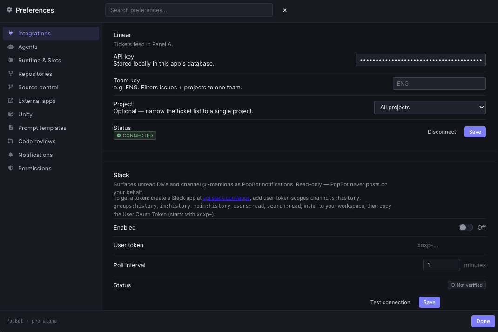
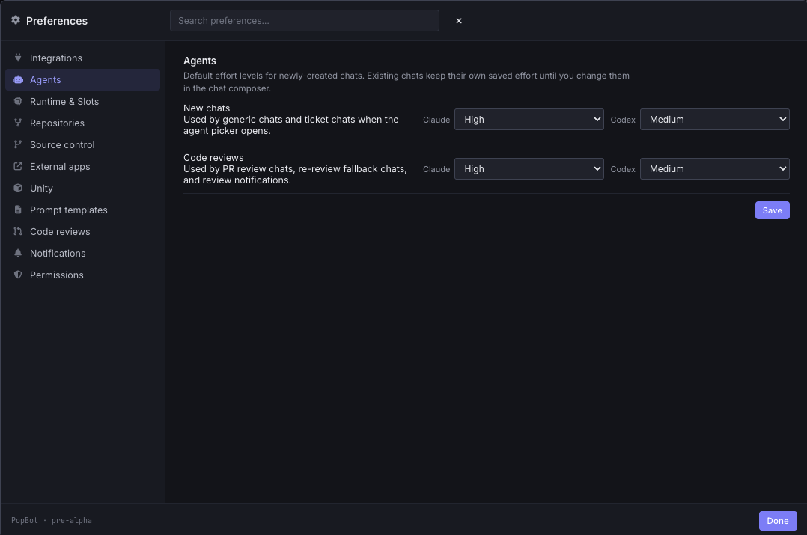
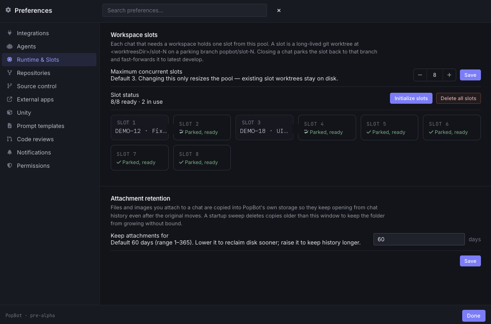
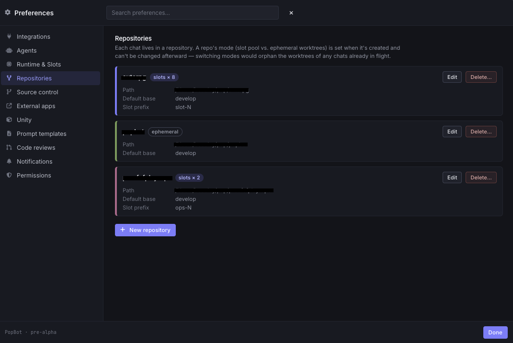
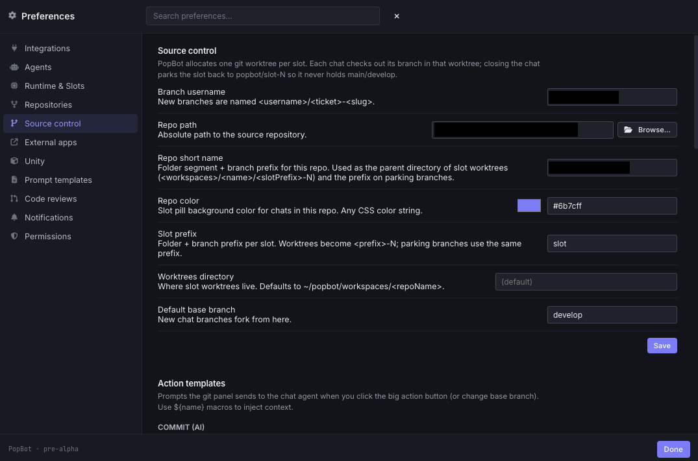
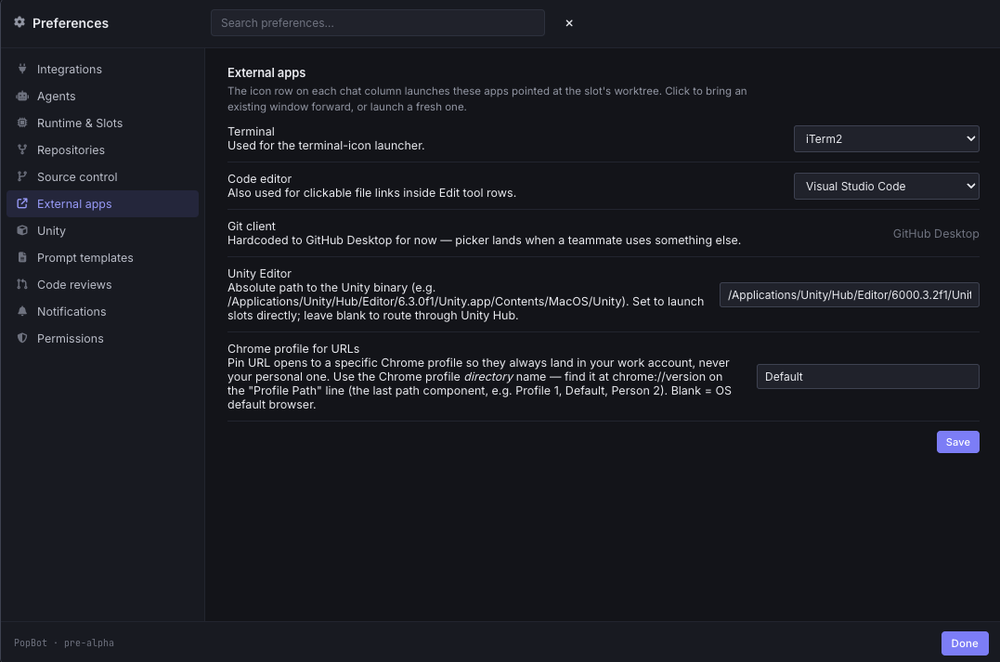
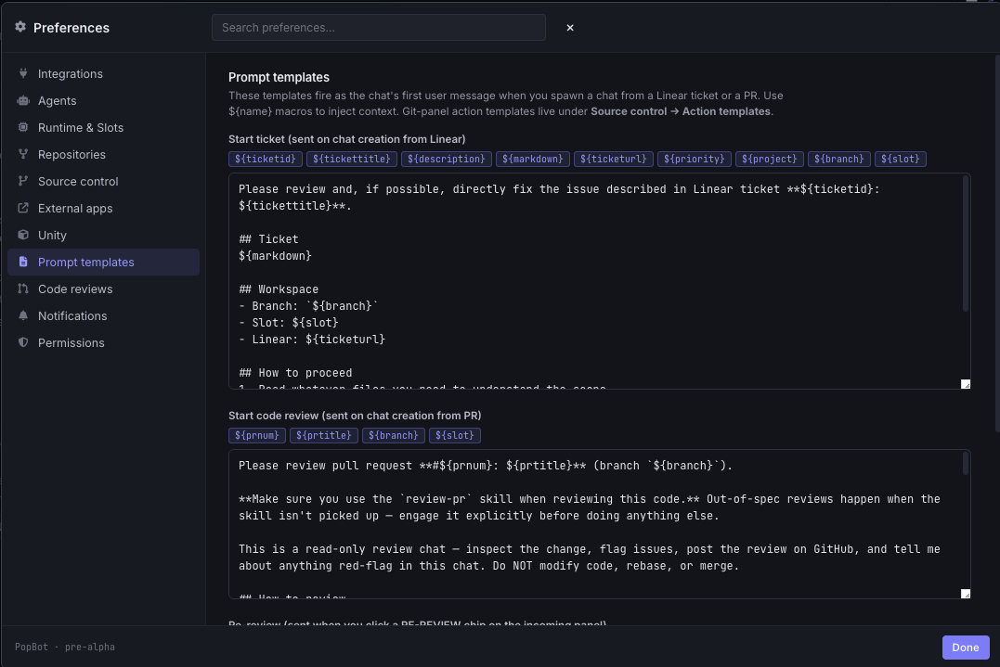
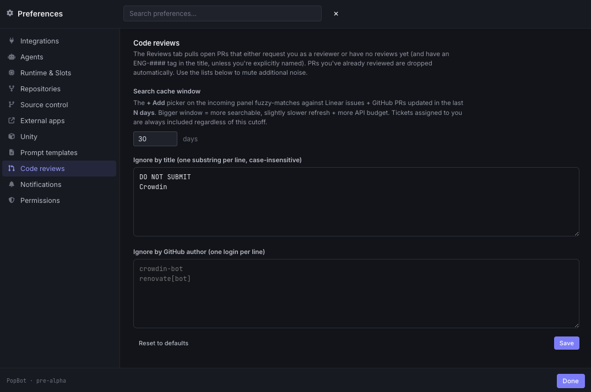
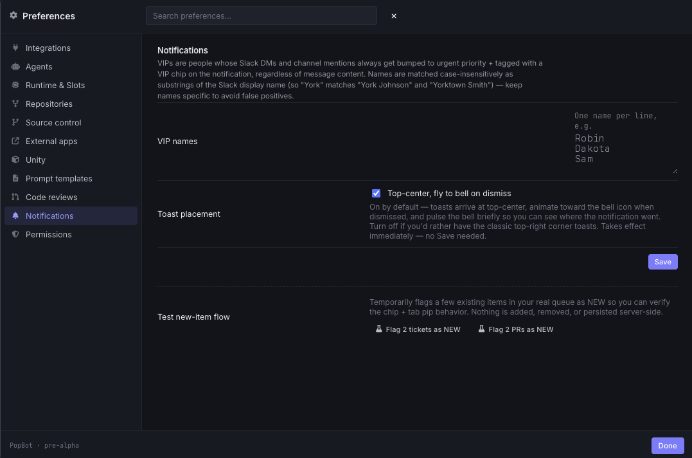
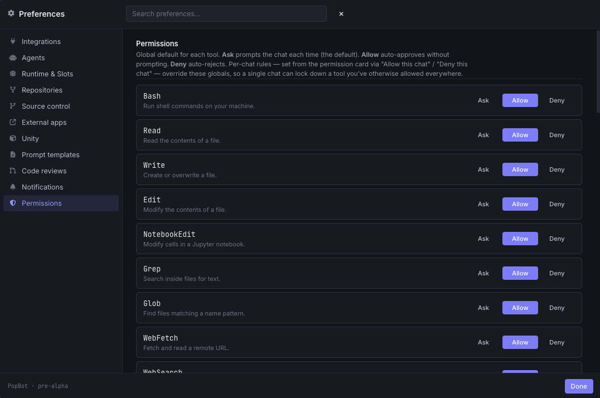

*Languages: [English](../CONFIGURATION.md) · [Español](../es/CONFIGURATION.md) · [Français](../fr/CONFIGURATION.md) · [Deutsch](../de/CONFIGURATION.md) · [日本語](../ja/CONFIGURATION.md) · [한국어](CONFIGURATION.md) · [简体中文](../zh-CN/CONFIGURATION.md) · [Português (Brasil)](../pt-BR/CONFIGURATION.md) · [Русский](../ru/CONFIGURATION.md) · [Italiano](../it/CONFIGURATION.md)*

# PopBot 설정하기

PopBot의 모든 것은 앱 안의 **환경설정**(제목 표시줄의 톱니바퀴, 또는 `⌘,`)을 통해 설정됩니다 — 손으로 편집해야 할 설정 파일은 없습니다. 이 가이드는 내비게이션이 나열하는 순서대로 모든 패널을 살펴보며, 이는 대체로 처음 설정할 때의 순서와 같습니다.

> 여러분이 입력하는 자격 증명(Linear, Jira, GitHub, Perforce 등)은 앱 자체 데이터베이스에 **여러분의 컴퓨터에 로컬로** 저장되며 — 이 리포지토리에는 절대 저장되지 않습니다.

- [연동](#연동) · [에이전트](#에이전트) · [런타임과 슬롯](#런타임과-슬롯) · [리포지토리](#리포지토리) · [소스 컨트롤](#소스-컨트롤) · [외부 앱](#외부-앱) · [프롬프트 템플릿](#프롬프트-템플릿) · [코드 리뷰](#코드-리뷰) · [알림](#알림) · [권한](#권한) · [언어](#언어)

---

## 연동

여기에는 두 개의 독립적인 그룹이 있습니다: 티켓 큐를 채우는 **티켓 소스**와, 슬롯이 실행할 수 있는 **게임 엔진**입니다.

### 티켓 소스

하나의 활성 이슈 트래커가 티켓 큐를 채웁니다. 패널 상단의 선택기에서 고르면, 아래의 설정 폼이 그에 맞게 바뀝니다. 한 번에 하나의 트래커만 활성화됩니다.

- **Linear** — API 키를 붙여넣으세요(*linear.app → Settings → API*에서). 선택적으로 **팀 키**(예: `ENG`)를 설정하여 티켓 피드를 한 팀으로 좁히고, **프로젝트**를 선택하여 더 좁힐 수 있습니다. 저장하면 키를 검증하고 어떤 계정으로 연결되었는지 보여줍니다.
- **Jira** — 사이트 URL(`https://your-domain.atlassian.net`), 계정 이메일, API 토큰(*id.atlassian.com → Security → API tokens*에서)을 입력하세요. 선택적으로 **프로젝트**로 범위를 좁히고 **JQL** 필터(예: `labels = backend`)를 추가할 수 있습니다. 저장하면 자격 증명을 유지하기 전에 검증합니다.
- **GitHub** — GitHub Issues는 여기서 자격 증명이 필요 없습니다. 프로바이더는 리뷰와 git 작업을 위해 이미 인증해둔 `gh` CLI를 실행하며, 큐는 [리포지토리](#리포지토리)에서 설정한 것과 동일한 리포지토리들을 다룹니다. 이 폼은 `gh`가 설치되어 있고 인증되어 있는지 확인하고 몇 개의 리포지토리를 다루는지 보고하는 상태 점검일 뿐입니다.

자격 증명이 있는 각 트래커는 **저장** 시 유지하기 전에 검증하며, *연결됨 / 연결되지 않음* 상태 알약을 보여줍니다.

### 게임 엔진

단일 선택인 티켓 소스와 달리, 엔진은 **독립적**입니다 — Unity, Unreal, 커스텀 엔진을 동시에 활성화할 수 있습니다. 활성화된 각 엔진은 채팅 바에 채팅의 슬롯 워크스페이스로부터 해당 엔진의 에디터를 실행하는 **실행(Run)** 버튼을 추가합니다.

- **활성화됨** — 채팅 바에서 해당 엔진의 실행 버튼을 나타내거나(또는 숨기는) 엔진별 체크박스입니다.
- **감지된 설치 항목 / 에디터 바이너리** *(Unity, Unreal)* — PopBot은 설치된 에디터(Unity Hub / Epic 설치)를 스캔하며 **다시 스캔** 링크가 있습니다. 감지된 버전을 선택하거나, 절대 경로인 **에디터 바이너리** 경로를 입력하여 드롭다운을 재정의하세요.
- **실행 명령** *(커스텀)* — 프로젝트 디렉터리에서 실행되는 자유 형식 셸 명령이며, 하나의 설정이 크로스 플랫폼으로 작동하도록 **macOS/Linux**와 **Windows**의 변형이 별도로 있습니다. 커스텀 엔진에는 자동 감지 기능이 없습니다. PopBot은 `POPBOT_SLOT` 환경 변수를 통해 슬롯 아이덴티티를 여러분의 명령에 전달하므로 자신만의 "실행하고 검증" 플로우를 배선할 수 있습니다.
- **프로젝트 하위 경로** — 워크스페이스 루트를 기준으로 한 엔진 프로젝트의 경로(Unity 프로젝트 폴더, `.uproject`를 담고 있는 폴더, 또는 커스텀 명령이 실행되는 작업 디렉터리). 워크스페이스 루트가 곧 프로젝트라면 비워두세요.
- **MCP 사용 + 베이스 MCP 포트** *(Unity, Unreal)* — **MCP 사용** 체크박스가 켜져 있으면, 에디터는 에이전트가 구동할 수 있도록 에디터 내 MCP 서버를 가리키며 실행됩니다. 각 슬롯은 병렬 슬롯들이 결코 충돌하지 않도록 **자신만의 포트**를 받습니다. 포트는 `basePort + (slotId − 1)`입니다(슬롯 1 → 베이스, 슬롯 2 → 베이스 + 1, …). **베이스 MCP 포트** 필드는 슬롯 1의 포트를 설정하며, 기본값은 **Unreal은 8000**, **Unity는 8080**입니다(각 엔진의 MCP 플러그인 기본값과 일치). 비우면 이 기본값으로 복원됩니다.
- **제목 표시줄에 프로젝트 경로 표시** *(Unity)* — Unity 프로젝트에 작은 에디터 스크립트를 넣는 **제목 표시줄 스크립트 설치** 버튼으로, 열려 있는 각 에디터가 제목 표시줄에 전체 프로젝트 경로를 표시하도록 하여 슬롯 창을 구분하기 쉽게 만듭니다. 이 스크립트는 커밋해도 안전합니다.

> **Slack**과 **Sentry**는 배선된 인박스 소스가 아니라 연결 스텁으로 남아 있으므로, 오늘은 여기에 패널로 표시되지 않습니다. 구조적 변경 없이 다시 활성화될 수 있습니다. [기능 및 워크플로 가이드](GUIDE.md) 끝의 노트를 참고하세요.

## 에이전트

새로 생성된 채팅의 기본 모델 **추론 강도**입니다(기존 채팅은 여러분이 채팅 작성창에서 바꾸기 전까지 자신만의 설정을 유지합니다).

- **Claude**와 **Codex**에 대해 독립적으로 강도를 설정하며, 다음에 대해서도 각각 설정합니다.
  - **새 채팅** — 일반 채팅과 티켓 채팅.
  - **코드 리뷰** — PR 리뷰 채팅, 재검토 폴백 채팅, 리뷰 알림.

강도가 높을수록 더 깊은 추론과 더 철저한 도구 사용을 의미하며, 비용과 지연 시간도 늘어납니다. 리뷰는 종종 기능 빌드와 다른 깊이를 원합니다. 그래서 이렇게 나뉘어 있습니다.

## 런타임과 슬롯

이 패널은 **첨부 파일 보존**을 제어합니다.(슬롯 풀 크기 설정은 이제 리포지토리별로 이루어지며 [리포지토리](#리포지토리) 아래에 있습니다 — 그곳의 노트를 참고하세요.)

- **첨부 파일 보관 기간** — 채팅에 첨부한 파일과 이미지가 PopBot 자체 저장소에 보관되는 기간(기본값 60일, 범위 1~365). 첨부 파일은 PopBot의 저장소에 복사되어 원본이 이동해도 채팅 히스토리에서 계속 열리도록 하며, 시작 시 이 기간보다 오래된 복사본을 삭제하는 정리 작업이 실행되어 폴더가 무한정 커지지 않도록 합니다.

> 위 스크린샷은 슬롯 풀 크기 설정이 리포지토리별 플로우로 분리되기 이전의 것일 수 있습니다.

## 리포지토리

각 채팅은 하나의 **리포지토리**에 존재합니다. 이 패널은 여러분의 리포지토리를 나열하며, 리포지토리별 소스 컨트롤, 슬롯, 카피-온-라이트 워크스페이스를 설정하는 곳입니다.

- **리포지토리 추가**는 폴더 우선 마법사를 엽니다. 폴더를 선택하면 PopBot이 **소스 컨트롤을 감지**하고(Git 또는 Perforce) 그에 맞게 분기합니다. 그런 다음 id, 강조 색상, 슬롯 접두사, 슬롯 개수를 설정합니다.
  - **Git** 리포지토리는 **슬롯** 모드(재사용되는 워크스페이스 풀 — 기본값, `slots × N`으로 표시됨)나 **에페메랄** 모드(채팅마다 새로운 워크스페이스)를 선택합니다. 슬롯 모드는 채팅 간 빌드 캐시를 웜하게 유지합니다.
  - **Perforce** 리포지토리는 항상 슬롯 모드입니다. 마법사는 P4 연결 정보를 받고, **디스크 사전 점검**을 실행하고, 동기화된 트리의 고정된 **베이스 이미지**를 만듭니다. 그런 다음 슬롯은 그 베이스의 카피-온-라이트 자식으로 생성됩니다(아래 참고).
- **카피-온-라이트 워크스페이스.** 슬롯의 워크스페이스는 리포지토리의 하나의 **베이스 이미지**를 공유하고, 변경된 블록만 저장하는 카피-온-라이트 폴더입니다. `shado`(PopBot의 섀도 워크스페이스 레이어)를 통해서입니다: Windows에서는 **디퍼런싱 VHDX**, macOS와 Linux에서는 네이티브 카피-온-라이트(APFS/reflink). 테라바이트급 트리에서 열 개의 슬롯은 대략 리포지토리 하나 분량의 디스크에 각 슬롯의 작은 델타를 더한 정도의 비용이 듭니다. 이것이 바로 큰 Perforce 트리가 애초에 참여할 수 있게 해주는 요소입니다. 베이스 이미지는 리포지토리 추가 마법사의 한 단계로서 한 번만 만들어집니다.
- **모드는 영구적입니다.** 리포지토리의 슬롯 대 에페메랄 모드는 생성 시 고정됩니다. 전환하면 진행 중인 채팅의 워크스페이스가 고아가 됩니다.
- 리포지토리의 강조 색상, 기본 베이스 브랜치(Git), Perforce 에이전트 작업 디렉터리를 바꾸고, **슬롯 크기 조정**(그 리포지토리의 모든 채팅이 닫혀 있는 것을 조건으로 풀을 워크스페이스 단위로 늘리거나 줄임)을 하려면 리포지토리를 **편집**하세요.
- 리포지토리를 **삭제**합니다. 채팅이 여전히 이를 참조하고 있다면 확인 대화상자가 경고합니다.

여러 리포지토리가 나란히 실행되며, 각각 고유한 슬롯 풀과 강조 색상을 가집니다(이 색상은 그 리포지토리의 슬롯 알약에 색조를 입혀 한눈에 채팅을 구분할 수 있게 해줍니다). 각 리포지토리 카드는 자신의 소스 컨트롤 프로바이더와 모드를 보여줍니다.

## 소스 컨트롤

전역 소스 컨트롤 설정과 편집 가능한 액션 템플릿입니다. Git과 Perforce 패널이 나란히 표시됩니다. 리포지토리의 프로바이더는 폴더별로 감지되고, 둘 다 동시에 사용 중일 수 있기 때문입니다.

- **변경 사항 뷰 파일 한도** *(공유)* — 목록이 제한되기 전에 변경 사항 뷰에 표시되는 최대 파일 수입니다. Git과 Perforce 모두에 적용됩니다.

**Git**

- **브랜치 사용자 이름** — 새 브랜치의 접두사: `<username>/<ticket>-<slug>`.
- **액션 템플릿** — SCM 패널이 **커밋**, **PR 푸시**, **드래프트 PR 푸시**, **리뷰 준비 완료**, **CR 반영**, **베이스로 리베이스**를 위해 에이전트에게 보내는 프롬프트입니다. 각각 `${name}` 매크로(`${branch}`, `${baseBranch}`, `${ticket}`, `${prnum}`, `${prurl}`…)를 지원합니다.

**Perforce**

- **연결 기본값** — `p4` 바이너리 경로, 기본 서버 포트, 기본 사용자로, 리포지토리 추가 → Perforce 연결 단계를 미리 채웁니다.
- **전송/제출 옵션** — 병렬 동기화 스레드 수, 제출 시 변경되지 않은 파일을 되돌릴지 여부.
- **Swarm 리뷰 폴링 간격** — 리뷰 패널이 여러분의 리뷰를 기다리는 체인지리스트를 위해 Helix Swarm을 폴링하는 빈도입니다. 이는 **GitHub의 폴링과 독립적**이며 **30초의 하한선**이 있습니다. 규모가 있는 환경에서 공유 Perforce/Swarm 서버의 부하를 줄이려면 이를 늘리세요.
- **Perforce 액션 템플릿** — Perforce 패널이 **CR**(Helix Swarm 리뷰 열기/업데이트), **테스트 실행**, **리뷰 후 커밋**을 위해 에이전트에게 보내는 프롬프트로, 각각 `${name}` 매크로가 있습니다.

## 외부 앱

채팅의 아이콘 행에서 PopBot이 실행하는 데스크톱 앱들로, 모두 해당 채팅의 슬롯 워크스페이스를 가리킵니다.

- **터미널** — 터미널 아이콘 실행기가 여는 터미널(예: iTerm2).
- **터미널 셸(Windows)** — 앱 내 터미널 패널이 사용하는 셸: PowerShell, 명령 프롬프트, PowerShell 7. 변경 이후 열리는 터미널에 적용됩니다.
- **코드 에디터** — VS Code 또는 Cursor. Edit 도구 행에서 클릭 가능한 `file.ts:42` 링크에도 사용됩니다.
- **Git 클라이언트** — 기본값은 GitHub Desktop입니다.
- **URL을 위한 Chrome 프로필** — 링크 열기를 특정 Chrome 프로필(프로필 *디렉터리* 이름 기준)에 고정하여 항상 여러분의 업무 계정으로 열리도록 합니다.

> 엔진 바이너리와 그 MCP 옵션은 여기가 아니라 [연동 → 게임 엔진](#연동)에서 설정됩니다.

## 프롬프트 템플릿

채팅이 생성될 때 PopBot이 보내는 첫 메시지입니다. 모든 템플릿은 그것이 사용할 수 있는 `${name}` 매크로의 참조 카드와 함께 편집 가능합니다.(SCM 패널 액션 템플릿은 [소스 컨트롤](#소스-컨트롤)에 있습니다.)

- **티켓 시작** — 소스(Linear, Jira, GitHub Issues)에 관계없이 티켓으로부터 채팅을 생성할 때 실행됩니다. 매크로에는 `${ticketid}`, `${tickettitle}`, `${markdown}`, `${branch}`, `${slot}`이 포함됩니다.
- **코드 리뷰 시작** — GitHub PR이나 Helix Swarm 체인지리스트인 리뷰로부터 채팅을 생성할 때 실행됩니다. 기본값은 에이전트에게 리뷰 스킬을 사용하고, diff뿐 아니라 주변 코드를 읽고, 채팅을 읽기 전용으로 취급하도록 지시합니다.
- **재검토** — 기존 리뷰 채팅을 재검토할 때 실행되며, 에이전트를 새로운 커밋만으로 범위를 좁힙니다.

이것들을 조정하여 여러분 팀의 관례, 체크리스트, 어조를 담아내세요.

## 코드 리뷰

**리뷰** 인박스에 대한 제어입니다. 큐는 여러분의 리뷰를 기다리는 GitHub PR과 Helix Swarm 체인지리스트를 표시하며, 이미 리뷰한 PR은 자동으로 제외됩니다.

- **검색 캐시 기간** — **+ 추가** 선택기가 최근 티켓과 PR을 퍼지 매칭하는 기간을 며칠까지 거슬러 올라갈지(더 크면 검색 범위는 넓어지지만 새로고침이 약간 느려지고 API 예산도 더 소모됩니다). 여러분에게 할당된 티켓은 이 한도와 관계없이 항상 포함됩니다.
- **제목으로 무시하기** — PR을 큐에서 제외하는 부분 문자열(한 줄에 하나, 대소문자 구분 없음).
- **GitHub 작성자로 무시하기** — 음소거할 봇/작성자 로그인(한 줄에 하나, 예: `renovate[bot]`).

> 리뷰 **폴링 속도**는 여기가 아니라 프로바이더별로 설정됩니다. Helix Swarm 폴링 간격은 [소스 컨트롤 → Perforce](#소스-컨트롤)에 있으며 GitHub의 폴링과 독립적이므로, GitHub를 느리게 하지 않으면서 공유 Perforce/Swarm 서버를 보호할 수 있습니다.

## 알림

알림이 나타나는 방식입니다.

- **VIP 이름** — 항상 긴급 우선순위로 올라가는 사람들의 메시지입니다. 표시 이름의 대소문자 구분 없는 부분 문자열로 매칭되므로, 이름을 구체적으로 유지하세요.
- **토스트 배치** — *상단 중앙, 닫으면 벨로 날아감*(기본값), 또는 전통적인 우측 상단 코너 토스트. 토글은 즉시 적용됩니다.
- **새 항목 플로우 테스트** — 몇 개의 실제 큐 항목을 일시적으로 NEW로 표시하여 칩/핍 동작을 미리 봅니다(아무것도 저장되지 않습니다). 이는 임시 개발 도구입니다.

## 권한

각 에이전트 도구의 전역 기본값과 자율 모드 아래의 하한선입니다.

- 각 도구(**Bash**, **Read**, **Write**, **Edit**, **Grep**, **Glob**, **WebFetch**, **WebSearch** 등)에 대해: **묻기**(매번 확인 — 기본값), **허용**(자동 승인), **거부**(자동 거절).
- **MCP 서버별 허용.** 슬롯의 에디터 MCP 서버(Unity, Unreal, 또는 에이전트가 로드하는 모든 MCP 서버)는 동일한 세 가지 방식으로 허용될 수 있습니다. 슬롯의 에디터 MCP를 한 번 허용하면 기억되며, 그 허가는 여기서 확인하고 철회할 수 있습니다 — 원시 네임스페이스가 아니라 `unityEditor → all tools` / `unrealEditor → all tools`로 표시됩니다. PopBot은 이 방식으로 Unity와 Unreal 에디터 MCP를 자동으로 활성화합니다. 와일드카드와 다른 도구별 규칙은 재정의로서 유지됩니다.
- 채팅별 규칙(권한 카드에서 *이 채팅 허용* / *이 채팅 거부*로 설정)은 이 전역 설정을 재정의하므로, 단일 채팅이 다른 모든 곳에서 허용한 도구를 잠글 수 있습니다.

> 하드 딜라이 하한선 — `git push` / `p4 submit`, 허용 목록에 없는 호스트로의 네트워크, 워크스페이스 바깥의 모든 것 — 은 코드에 존재하며 여기서 재정의할 수 **없습니다**. 그래서 잘못 설정된 규칙이 에이전트를 메인라인에 스스로 반영하게 만들 수는 없습니다.

## 언어

PopBot의 인터페이스는 완전히 현지화되어 있습니다.

- **표시 언어** — 언어 메뉴에서 인터페이스 로케일을 전환합니다. 메뉴는 각 언어를 그 언어 자체의 이름으로 나열합니다. 제공되는 로케일은 영어, 스페인어, 프랑스어, 독일어, 중국어(간체), 일본어, 한국어, 포르투갈어(브라질)입니다. 대부분의 텍스트와 메뉴는 즉시 업데이트되며, 일부 시스템 문자열은 재시작 후에 업데이트가 완료됩니다. 새 창과 앱 메뉴도 이 언어를 사용합니다.

---

이러한 설정들이 실제 워크플로에서 어떻게 작동하는지는 **[기능 및 워크플로 가이드](GUIDE.md)**를 참고하세요.
